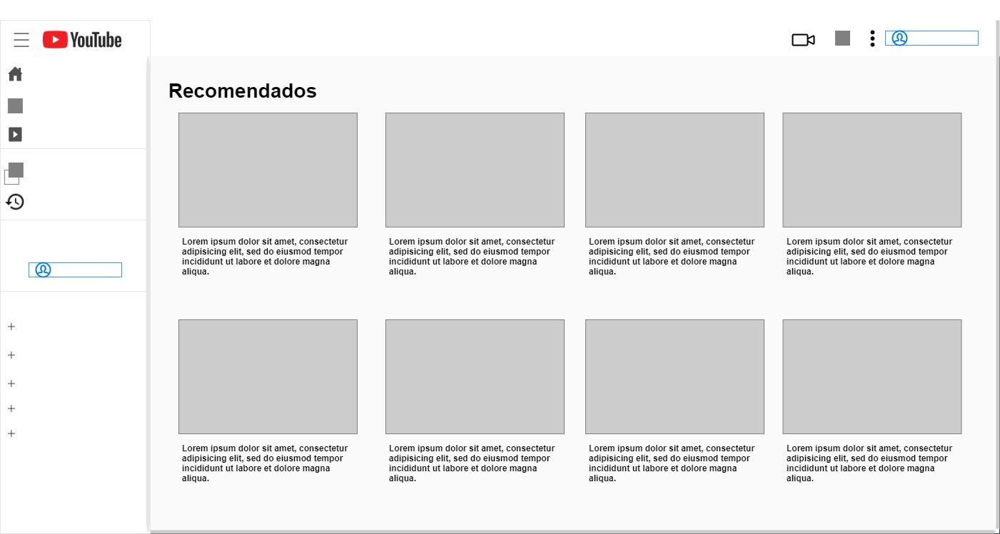

# YouTube-app

## Wireframe 



**Com base nesse tutorial do youtube [Recriando a interface  do youtube com Material-UI + React.JS](https://www.youtube.com/watch?v=u9FnmBdBl5k) foi realizado uma clonagem da tela inicial do youtube.**

**Link do projeto concluído no Netlify:** https://youtube-materialui.netlify.app/

## IDE
* Visual Studio Code
* Versão: 1.54.0 
* [Download Visual Studio Code](https://code.visualstudio.com/)

## As versões de pacote que utiliza esse projeto

```
{
    "@material-ui/core": "^4.10.2",
    "@material-ui/icons": "^4.9.1",
    "@testing-library/jest-dom": "^4.2.4",
    "@testing-library/react": "^9.3.2",
    "@testing-library/user-event": "^7.1.2",
    "react": "^16.13.1",
    "react-dom": "^16.13.1",
    "react-scripts": "3.4.1"
}
```    
## O que é [React.js?](https://pt-br.reactjs.org/)

**React.js é, portanto, uma biblioteca de JavaScript, open source, utilizada para construir user interfaces, nomeadas para aplicações de página única.** 

**O diferencial do React é ser rápida, escalável e simples, podendo ser usada com outras bibliotecas ou frameworks de JavaScript, como o Angular JS.**

**Assim, possibilita aos desenvolvedores criarem aplicações web, tendo a facilidade de alterar elementos ou os dados exibidos, sem recarregar a página. Por exemplo, o número de likes de uma rede social pode aumentar ou diminuir sem a necessidade de realizar o refresh na página.**

**Fonte: https://www.digitalhouse.com/br/blog/o-que-e-react-no-javascript-e-para-que-serve#:~:text=Conhecido%20como%20React.,no%20mundo%20do%20desenvolvimento%20web.**

Tutorial de como instalar: [Como instalar e utilizar o React no Windows](https://www.visualdicas.com.br/programacao/react/78-como-instalar-e-utilizar-o-react-no-windows#:~:text=%20Como%20habilitar%20o%20Windows%20para%20a%20utiliza%C3%A7%C3%A3o,o%20arquivo%20execut%C3%A1vel%20%28%20.msi%29%20para...%20More%20)

## O que é [Material-UI?](https://material-ui.com/pt/)

**Material-UI é uma biblioteca de componentes simples e personalizável para criar aplicativos React mais rápidos, bonitos e acessíveis.**

**Fonte: https://github.com/mui-org/material-ui**

Tutorial de como instalar: [Integração do Material UI com ReactJS](https://blog.rocketseat.com.br/react-material-ui/) ou [Pelo site oficial do Material-UI](https://material-ui.com/pt/)

